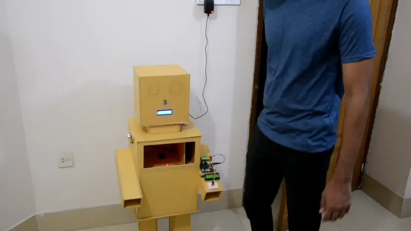
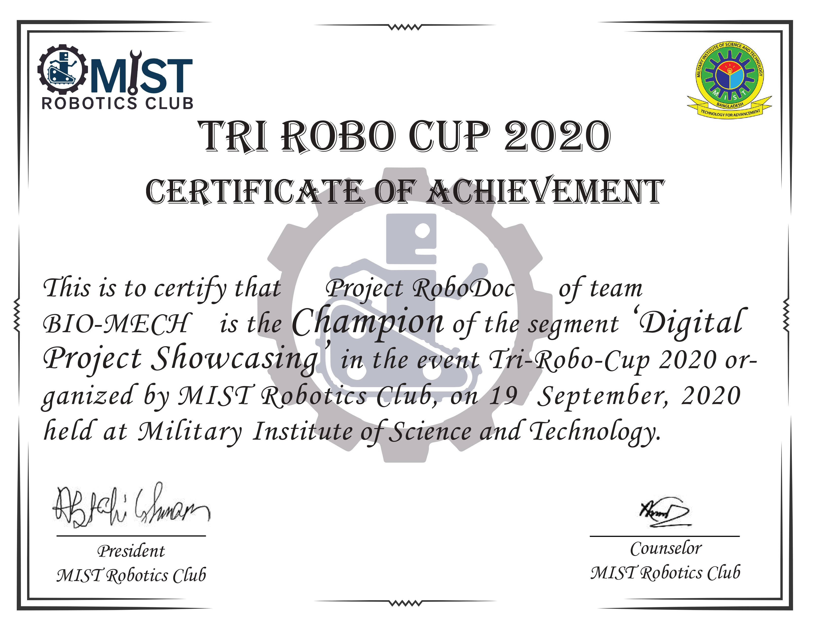

# Smart Health & Sanitization System
*Award-Winning Healthcare Innovation*

## System Glimpse!

## System Architecture

### 1. Automated Sanitizer Unit (Arduino)
| Component | Specification | Function |
|-----------|--------------|-----------|
| Sensor | HC-SR04 Ultrasonic | 10cm detection range |
| Actuator | 12V DC Pump | Controlled dispensing |
| Controller | Arduino UNO | System control |
| Power | 12V DC Supply | Main power source |

### 2. Health Monitoring Unit (NodeMCU)
| Component | Specification | Function |
|-----------|--------------|-----------|
| Temperature | MLX90614 | ±0.5°C accuracy |
| SpO2 | MAX30100 | Pulse oximetry |
| Display | 16x2 LCD | Real-time readings |
| Network | ESP8266 | WiFi connectivity |

## Key Features

### Sanitization System
- Touchless operation (10cm range)
- 1-second spray duration
- LED status indication
- Automatic cooldown
- Error detection

### Health Monitor
- Real-time vital monitoring
- Automated email alerts
- LCD status display
- Threshold-based warnings
- WiFi connectivity

## Alert Parameters
| Parameter | Normal Range | Alert Threshold |
|-----------|--------------|-----------------|
| Temperature | 35.0-37.5°C | Outside range |
| SpO2 | >95% | <95% |
| System Status | Active | Error states |

## Maintenance Guide
- Daily: Sensor cleaning, system check
- Weekly: Sanitizer refill, calibration
- Monthly: Full system diagnostics

## Technical Requirements
- Power: 12V DC, 2A
- Network: 2.4GHz WiFi
- Space: 30x20x15cm
- Environment: Indoor use

## Safety Features
- Automatic timeout
- Overflow protection
- Error notifications
- Power surge protection

## Championship Recognition 🏆
**TRI ROBO CUP 2020 - First Place**
- Awarded by MIST Robotics Club
- Category: Project Showcasing on Recent Issues
- Recognition: Outstanding Integration of IoT and Healthcare

---
*Version 2.0 | Last Updated: February 2025*

*For more details, please refer to the following links:*

- [Automatic Hand Sanitizer Dispenser](./hand-sanitizer.md)
- [Health Monitoring Unit](./health-monitor.md)
- [Sanitization System](./sanitizer-spray.md)

