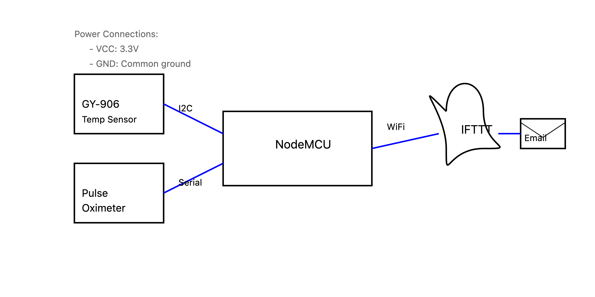

# Health Monitoring System




## Quick Start Guide

### System Overview
IoT-based health monitoring system that sends automated email alerts for temperature and SpO2 readings using NodeMCU and IFTTT integration.

### Components List
| Component | Specifications | Purpose |
|-----------|---------------|----------|
| NodeMCU ESP8266 | 3.3V, WiFi-enabled | Main controller |
| GY-906 (MLX90614) | I2C, 3.3V, ±0.5°C accuracy | Temperature sensing |
| Pulse Oximeter | Serial, 3.3V, 0-100% range | SpO2 measurement |

### Pin Connections
| NodeMCU Pin | Connection | Component |
|-------------|------------|-----------|
| 3.3V | VIN | Both sensors |
| GND | GND | Both sensors |
| D1 | SCL | GY-906 |
| D2 | SDA | GY-906 |
| D5 | TX | Pulse Oximeter |
| D6 | RX | Pulse Oximeter |

### Alert Parameters
| Parameter | Normal Range | Alert Threshold | Action |
|-----------|--------------|-----------------|--------|
| Temperature | 36.1°C - 37.2°C | > 37.5°C | Email alert |
| SpO2 | 95% - 100% | < 95% | Email alert |

## Setup Instructions

### 1. Hardware Setup
```cpp
// Connect components according to pin connection table
// Ensure stable 3.3V power supply
// Add 4.7kΩ pull-up resistors for I2C lines
```

### 2. IFTTT Configuration
1. Create IFTTT account
2. Create webhook trigger
3. Set email action
4. Note down API key

### 3. Software Configuration
```cpp
// Key Settings
const char* WIFI_SSID = "YOUR_SSID";
const char* WIFI_PASS = "YOUR_PASS";
const char* IFTTT_KEY = "YOUR_KEY";

// Thresholds
#define TEMP_ALERT 37.5
#define SPO2_ALERT 95
```

### Error Codes Reference
| Code | Meaning | Solution |
|------|----------|----------|
| E01 | Sensor Error | Check connections |
| E02 | WiFi Error | Verify credentials |
| E03 | IFTTT Error | Check API key |

## Maintenance Schedule
| Interval | Task | Notes |
|----------|------|-------|
| Daily | Check readings | Compare with reference |
| Weekly | Test alerts | Send test email |
| Monthly | Calibrate | Use reference device |

## Safety Notes
- Not a medical device
- For monitoring only
- Keep system dry
- Use proper power supply

## Quick Troubleshooting Guide
1. No Readings
   - Check power
   - Verify connections
   - Restart system

2. No Alerts
   - Check WiFi
   - Verify IFTTT
   - Test webhook

3. Incorrect Readings
   - Calibrate sensors
   - Check placement
   - Update threshold

## Required Libraries
```cpp
#include <ESP8266WiFi.h>
#include <Wire.h>
#include <Adafruit_MLX90614.h>
```

---
For detailed documentation and support:
- Hardware Datasheets: [Component Manufacturer Links]
- IFTTT API: https://ifttt.com/docs/api_reference
- ESP8266: https://arduino-esp8266.readthedocs.io/